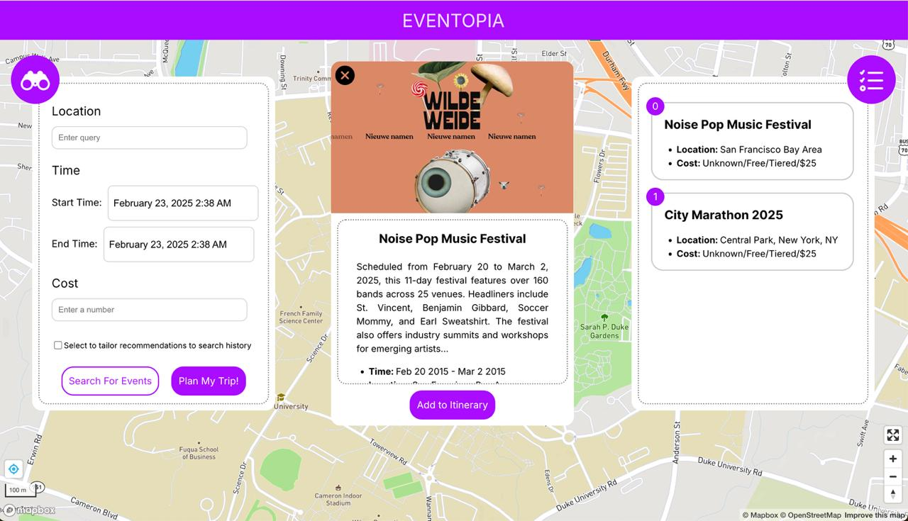

# Eventopia

*[LIVE AI Ivy Plus] Harvard-Duke Hackathon 2025*
* Adil Gazder (adil.gazder@duke.edu)
* Mobasserul Haque (mohammedmobasserul.haque@duke.edu)
* Neha Senthil (neha.senthil@duke.edu)
* Selina Zhan (Selina.zhan@duke.edu)

## Overview

Too many events happening around your city leads to information overload, choice paradox, lack of personalization, generic recommendations, disorganized information, budget and time constraints, and the need for additional planning and scheduling.

Eventopia is a smart event-planning app that provides a personalized solution for discovering and planning events.  It personalizes event recommendations, optimizes itineraries based on budget and time, and leverages user preferences (including optional browsing history analysis) to ensure a seamless and enjoyable experience.

Please click below for our [product video](https://youtu.be/0TjdkZcX_Mw)

## Features

* **Event Discovery:** Curates and recommends events based on user interests and geolocation, eliminating manual searching.

* **Itinerary Planning:** Designs efficient schedules by grouping nearby events within a user’s available time window and budget, maximizing their experience.

For interaction, feel free to try out our Figma prototype: https://www.figma.com/proto/G6tce7lOO85AtAWaGxJaSd/Eventopia?page-id=0%3A1&node-id=48-298&viewport=831%2C1619%2C0.21&t=5ZVTlWnUkOecd50X-1&scaling=scale-down&content-scaling=fixed&starting-point-node-id=48%3A298

## Tech Stack

* **Front End:** React, Typescript, HTML, CSS
* **Back End:** Gemini 2.0 flash (Multimodal), Flask, Python, SearchAPI

## Future Plans

* Real-time integration across groups and calendars to coordinate schedules
* Post-event feedback and recommendations
* Real-time updates and notifications
* Robust user history from social media platforms

## Team

* Selina Zhan (Selina.zhan@duke.edu)
* Adil Gazder (adil.gazder@duke.edu)
* Mobasserul Haque (mohammedmobasserul.haque@duke.edu)
* Neha Senthil (neha.senthil@duke.edu)